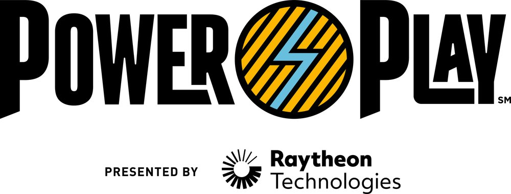
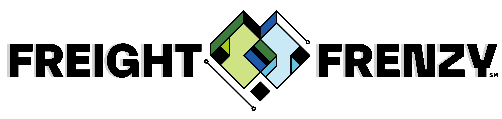
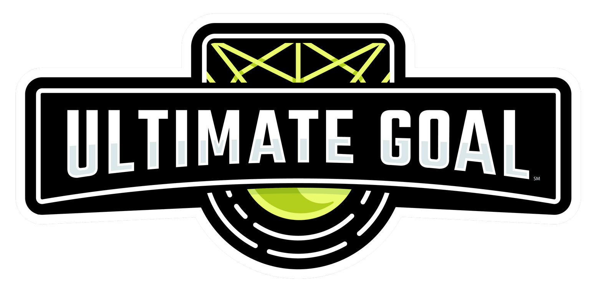
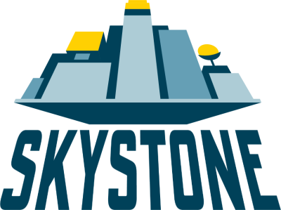
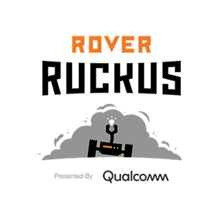
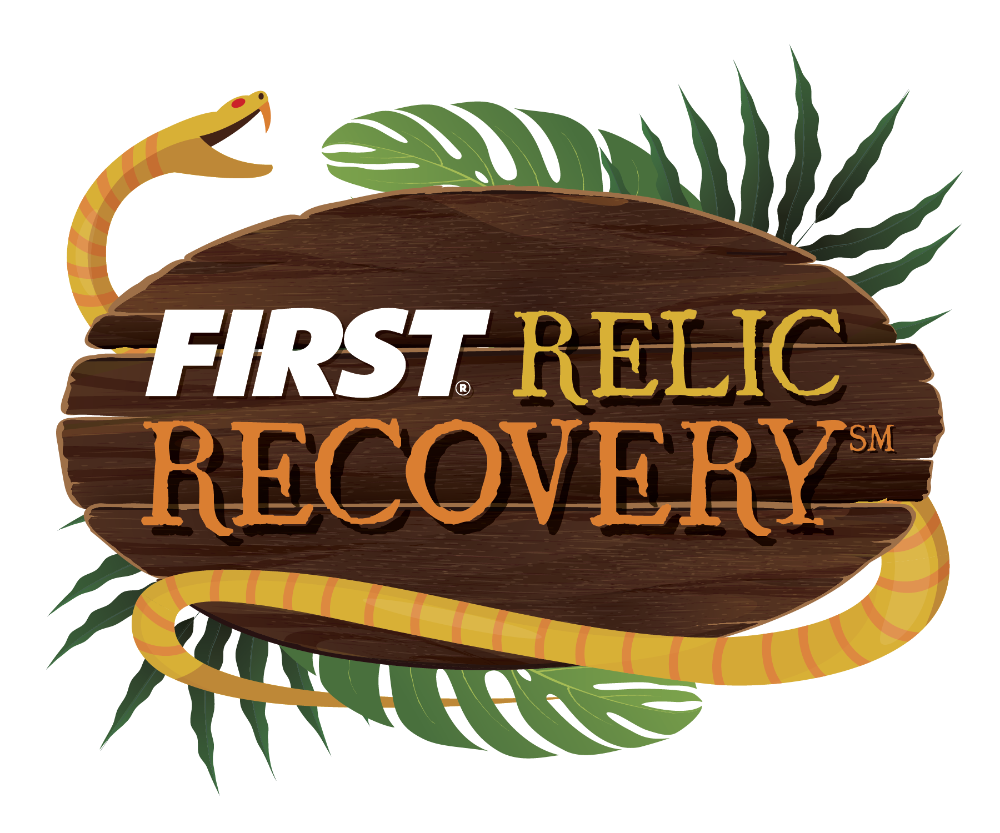
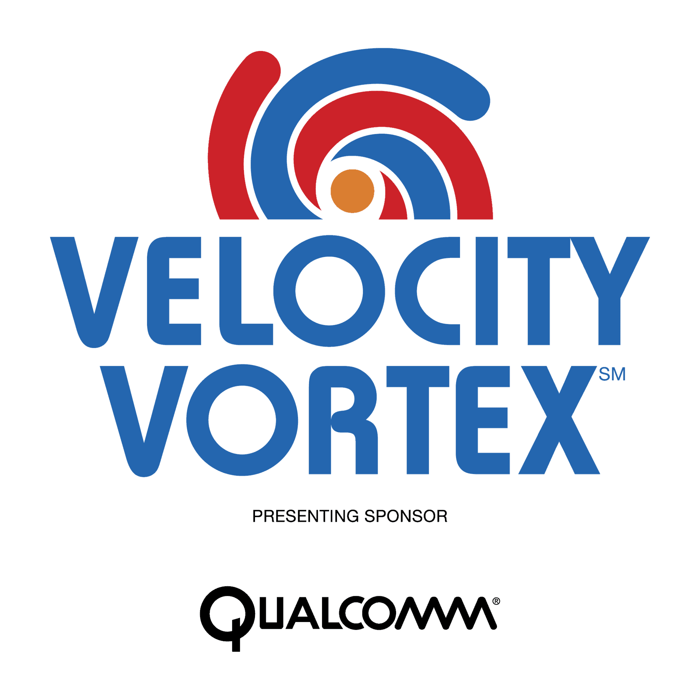
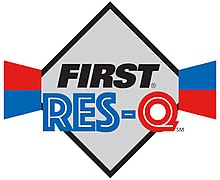
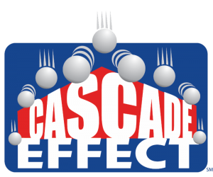
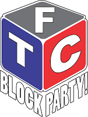

```{r setup, include=FALSE}
knitr::opts_chunk$set(echo = FALSE)
```

## Our Team's History by Season

### PowerPlay (Current: 2022-2023)
```{r powerplay, out.width = "300px"}

```

- Kentucky League Play
  - 10-0 Record
  - Kentucky State Record High Score of 168
  
- Miami University Ohio Qualifier
  - Winning Alliance Captain
  - Compass Award Winner
  - Control Award Winner
  - Ohio Team Spirit Award Winner
  - Ohio State Championship Qualifier
  - Ohio State Record High Score of 193

- Walnut Hills Qualifier 
  - Hosted 24 Teams
  - Finalist Alliance
  - Ohio State Record High Score of 210
 
- Kentucky State Championship
  - Winning Alliance Captain
  - Compass Award Winner
  - Promote Award 2nd Place
  - Control Award 2nd Place
  - Design Award 3rd Place
  - Think Award 3rd Place
  - Kentucky State Record High Score of 202
  - World Championship Qualifier

### Freight Frenzy (2021-2022)
```{r freight-frenzy, out.width = "300px"}

```

- Wright Flyer Katherine Qualifier
  - Inspire Award Winner
  - Ohio State Championship Qualifier

- Ohio State Championship
  - Inspire Award Winner
  - World Championship Qualifier

- World Championship
  - Control Award Finalist

### Ultimate Goal (2020-2021)
```{r ultimate-goal, out.width = "300px"}

```

- OSU Scarlet and Gray Qualifier
  - Collins Aerospace Innovate Award Winner
  - Robot Performance- 3rd Place
  - Ohio State Championship Qualifier
  - Promote Award Winner
  - Compass Award Winner- Phil Landman
  - High Score of 340 - Set Top Three Score Worldwide

- Wright Flyer Qualifier
  - Control Award 2nd Place
  - Think Award 2nd Place
  - Robot Performance- 3rd Place
  - Inspire Award- 2nd Place
  
- Vermont State Championship
  - Design Award 3rd Place
  - Control Award 2nd Place
  - Collins Aerospace Innovate Award Winner
  - Robot Performance- 2nd Place
  
- Gem City II Qualifier
  - Control Award 3rd Place
  - Collins Aerospace Innovate Award Winner
  - Robot Performance Winner
  - Inspire Award 2nd Place

- Ohio State Championship
  - Motivate Award 2nd Place
  - Robot Performance- 3rd Place
  - World Championship Qualifier

- World Championship
  - Cancelled due to Covid-19

- Maryland Tech Invitational
  - Robot Performance- 19th of 32 Teams

### Skystone (2019-2020)
```{r skystone, out.width = "300px"}

```

- West Virginia State Championship
  - Semi-Finalist Alliance
  - Inspire Award 2nd Place
  - Collins Aerospace Innovate Award Winner
  - Design Award 2nd Place

- Wapakoneta Ohio Regional Qualifier
  - Finalist Alliance
  - Motivate Award Winner

- Van Wert Ohio Regional Qualifier
  - Finalist Alliance Captain
  - Think Award Winner

- Newark Ohio Regional Qualifier
  - Finalist Alliance
  - Ohio Spirit Award Winner
  - Collins Aerospace Innovate Award Winner
  - Design Award 2nd Place
  - Think Award 2nd Place
  
- Ohio State Championship
  - Cancelled due to Covid-19 

### Rover Ruckus (2018-2019)
```{r rover-ruckus, out.width = "300px"}

```

- Ohio State Championship
  - Control Award Winner

- Bluegrass Invitational Tournament
  - Finalist Alliance

- Indiana Robotics Invitational
  - Winning Alliance

### Relic Recovery (2017-2018)
```{r relic-recovery, out.width = "300px"}

```

- West Virginia State Championship
  - Semi-Finalist Alliance
  - Think Award Second Place

- Dayton Regional
  - Winning Alliance- First Pick
  - Inspire Award Winner
  - Rockwell Collins Innovate Award Second Place
  - Ohio State Championship Qualifier

- Southwest Pennsylvania Regional
  - Winning Alliance- First Pick
  - Think Award Winners
  - Connect Award Second Place
  - Pennsylvania State Championship Qualifier

- Ohio State Championship
  - Winning Alliance
  - North Super Regional Qualifier

- North Super Regional
  - Tinker Division Semi-Finalist Alliance Captain
  - World Championship Qualifier

- World Championship
  - Edison Division Semi-Finalist Alliance Captain

### Velocity Vortex (2016-2017)
```{r velocity-vortex, out.width = "200px"}

```

- Dayton Regional
  - Finalist Alliance
  - Think Award Winner
  - Ohio State Championship Qualifier

- Kentucky State Championship
  - Finalist Alliance
  - Motivate Award Winner
  - Control Award Second Place
  - Rockwell Collins Innovate Award Third Place

### Res-Q (2015-2016)
```{r res-q, out.width = "300px"}

```

- Newark Regional
  - Winning Alliance- First Pick
  - Ohio State Championship Qualifier

- Ohio State Championship
  - Inspire Award Second Place
  - Motivate Award Winner
  - North Super Regional Qualifier

- North Super Regional
  - Ortberg Division Semi-Finalist Alliance

### Cascade Effect (2014-2015)
```{r cascade-effect, out.width = "300px"}

```

- Northern Indiana Regional
  - Winning Alliance
  - PTC Design Award Winner
  - Indiana State Championship Qualifier

- Dayton Regional
  - Winning Alliance Captain
  - Promote Award Winner
  - PTC Design Award Winner
  - Ohio State Championship Qualifier

- Columbus Regional
  - Finalist Alliance Captain

- Ohio State Championship
  - Finalist Alliance Captain
  - North Super Regional Qualifier

- North Super Regional
  - Winning Alliance- First Pick
  - World Championship Qualifier

- World Championship
  - Franklin Division Semi-Finalist Alliance

### Block Party (2013-2014)
```{r block-party, out.width = "300px"}

```

- Cleveland Regional
  - Connect Award Winner
  - Ohio State Championship Qualifier

- Cincinnati Regional
  - Winning Alliance

- Southwest Indiana Regional
  - Winning Alliance
  - Indiana State Championship Qualifier

- Ohio State Championship
  - Finalist Alliance

- Indiana State Championship
  - PTC Design Award Winner

### Ring It Up (2012-2013)
```{r ring-it-up, out.width = "300px"}

```

- Dayton Regional
  - Think Award Winner
  - Ohio State Championship Qualifier
